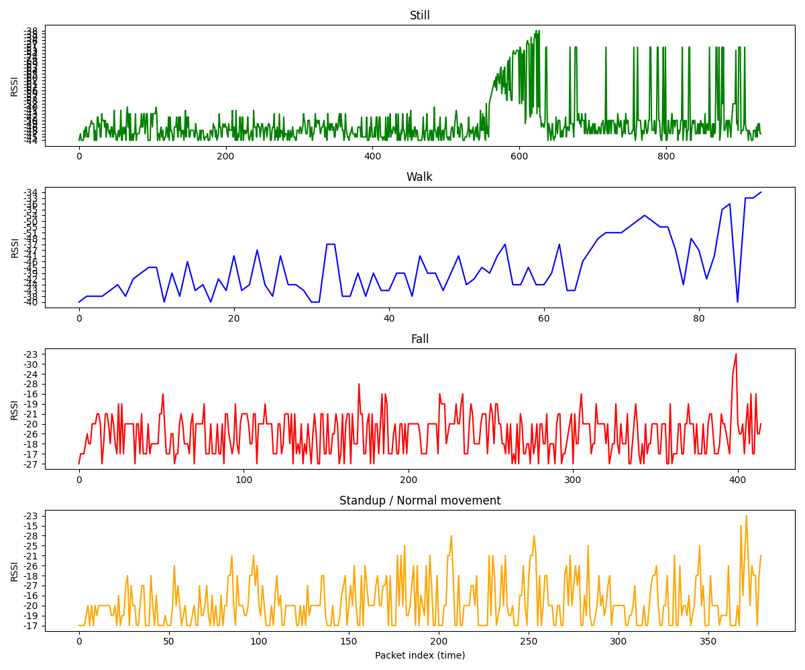

# WiFi-Based Fall Detection using CSI

A machine learning system that detects human falls using WiFi Channel State
Information (CSI) — no wearable device or camera required. Built as a
camera-free, privacy-preserving alternative to vision-based elderly-care
monitoring systems.

## How it works
WiFi signals bounce off people in a room (multipath), and these reflections
are captured as CSI — amplitude/phase values across subcarriers and antennas.
A fall causes a distinct pattern: a sharp, brief disturbance in the signal
followed by stillness, unlike walking (a sustained, periodic pattern) or
sitting (gradual change).

## Dataset
[UT-HAR dataset](https://github.com/ermongroup/Wifi_Activity_Recognition)
(Yousefi et al., IEEE Communications Magazine 2017) — 7 activities: lie down,
fall, walk, pickup, run, sit down, stand up. ~4,973 samples total, each a
250-timestep × 90-value (30 subcarriers × 3 antennas) CSI window.

Download the preprocessed data from [this Google Drive folder]
(https://drive.google.com/drive/folders/1R0R8SlVbLI1iUFQCzh_mH90H_4CW2iwt)
(UT_HAR subfolder only) and place it at `data/UT_HAR/`.

## Approach
- Binary classification: fall vs. all other activities
- Features: mean, standard deviation, and max amplitude change per CSI
  subcarrier across the time window
- Model: Random Forest (class-balanced, to handle fall being a minority class)

## Results
| Model | Accuracy | Precision (fall) | Recall (fall) |
|---|---|---|---|
| Random Forest (class-balanced) | 97.8% | 0.95 | 0.80 |
| LSTM (class-weighted, default threshold) | 92.8% | 0.57 | 0.87 |
| **LSTM (class-weighted, tuned threshold=0.95)** | **96.4%** | **0.72** | **0.98** |

**Note:** recall matters more than accuracy here — a missed fall is the
costly failure mode for a real safety system. The dataset is imbalanced
(only ~9% of samples are falls). Threshold tuning (optimizing for
F2-score, which weights recall 2x more than precision) improved the
LSTM from catching 87% of falls to 98%, while also recovering much of
the precision lost from class-weighting. Note the test set contains
only 45 fall samples, so this recall figure should be read as a strong
signal rather than a guaranteed rate on unseen data.

## Setup
```
pip install -r requirements.txt
python src/train_baseline.py
```


## Acknowledgments
Data loading approach adapted from [SenseFi]
(https://github.com/xyanchen/WiFi-CSI-Sensing-Benchmark) (Yang et al., 2023).

## Future work
- Deep learning models (LSTM/CNN) on raw CSI instead of handcrafted features
- Real hardware capture using ESP32 CSI Tool for live testing
- Multimodal fusion with accelerometer-based fall detection


## Hardware validation (ESP32 CSI capture)
Beyond the UT-HAR dataset, I validated the core hypothesis on my own
ESP32 hardware (ESP32 dev board as AP, running Espressif's CSI-enabled
ESP-IDF firmware from the ESP32-CSI-Tool project). I captured RSSI/CSI
data across four labeled activities (still, walk, fall, standup).



RSSI alone clearly separates "still" (bounded, ~15 dBm range) from
active movement (all three movement activities show 20+ dBm swings),
confirming that WiFi signal disruption reliably detects human motion.
Distinguishing fall specifically from walk/standup using RSSI alone
proved harder — consistent with why CSI research prefers the full
multi-subcarrier CSI array over RSSI, since RSSI is a single-value
summary that loses the finer-grained frequency information CSI provides.